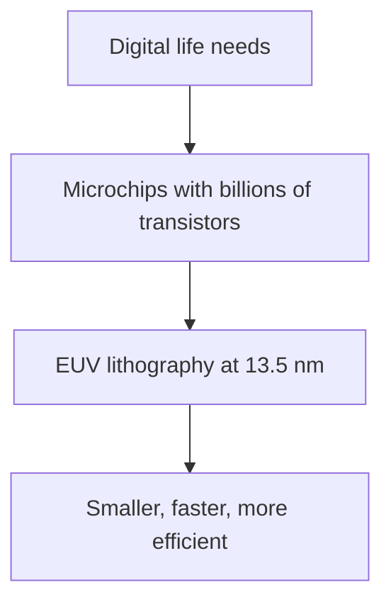

import AccessibleImage from '@site/src/components/AccessibleImage';
import AnimatedBlock from '@site/src/components/AnimatedBlock';
import Plot from '@site/src/components/Plot';

<AnimatedBlock>

Microchips power phones, laptops, AI accelerators, cars, and cloud servers. Each advanced chip hosts billions of transistors wired together in nanoscale patterns.

</AnimatedBlock>

:::note Definition: Lithography
Lithography transfers a designed pattern (on a photomask/reticle) onto a wafer coated with a light-sensitive film (photoresist). Development and etch turn that pattern into real structures in silicon and metals.
:::

:::tip Thought Experiment
If you scaled the tiny chip features up to readable text, a modern GPU could "fit" the equivalent of entire book collections — from the Harry Potter series to the English Wikipedia — etched with atomic-level precision.
:::

## Why EUV?

<AnimatedBlock>

To keep shrinking features, we need shorter wavelengths and better optics. EUV uses 13.5 nm light — far shorter than conventional deep ultraviolet (DUV) at 193 nm — enabling much finer features.

</AnimatedBlock>

## What's inside a modern chip?

<AnimatedBlock>

At a high level, chips integrate three big things:

- **Transistor layers**: billions of tiny switches that compute
- **Interconnect layers**: thin metal wires that connect switches  
- **Power and I/O layers**: routes that bring power in and signals out

</AnimatedBlock>

<Plot
  data={[
    {
      values: [55, 25, 20],
      labels: ['Transistors', 'Lower interconnect', 'Upper interconnect & I/O'],
      type: 'pie',
      marker: {
        colors: ['#2ea3ff', '#71c7ec', '#a8e6cf']
      }
    }
  ]}
  layout={{
    title: 'Modern Chip Composition',
    font: { family: 'Inter, sans-serif' }
  }}
  staticFallback="/img/static/chip_composition.png"
/>

  

    <AccessibleImage 
      src="/img/wafer_fab_bay_photo.png" 
      alt="EUV lithography tools installed in a modern 300mm semiconductor fabrication cleanroom showing multiple large machines"
      caption="Figure 1: EUV tools installed in a modern 300 mm fab bay"
    />
  

  

    <AnimatedBlock>

    </AnimatedBlock>
  

:::tip Takeaway
EUV lithography is a key enabler of the chips that drive AI, mobile, and cloud computing.
:::

## Quick Q&A

<strong>Why not keep using 193 nm DUV for everything?</strong>

<AnimatedBlock>

It becomes increasingly hard to pattern ever-smaller features with longer wavelengths. You can use tricks (multiple patterning), but complexity and cost rise rapidly. EUV at 13.5 nm makes the smallest features more straightforward.

</AnimatedBlock>

<strong>Why are transistors so small?</strong>

<AnimatedBlock>

Smaller devices switch faster and use less energy, enabling higher performance and lower power. But they demand extreme precision in manufacturing.

</AnimatedBlock>

