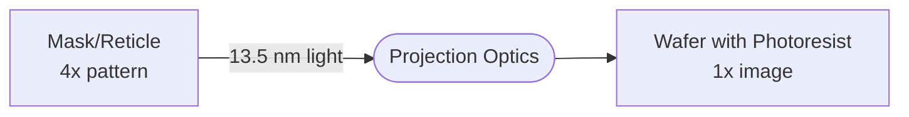
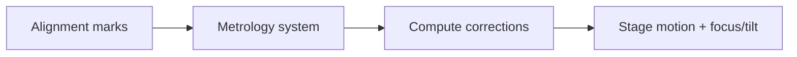

import AccessibleImage from '@site/src/components/AccessibleImage';
import AnimatedBlock from '@site/src/components/AnimatedBlock';
import Plot from '@site/src/components/Plot';

<AnimatedBlock>

Photolithography is like projecting a stencil onto photosensitive paint. A mask carries the pattern; optics image it onto photoresist on the wafer; development reveals the pattern; etch transfers it into materials.

</AnimatedBlock>

:::note Definition: Photoresist
A polymer film that changes solubility when exposed to light. Positive resists become more soluble where exposed; negative resists become less soluble.
:::

## The Lithography Cycle

<AnimatedBlock>

```mermaid
flowchart LR
  A[Coat resist] --> B[Align]
  B --> C[Expose (mask + optics)]
  C --> D[Develop]
  D --> E[Etch / Deposition]
  E --> F[Strip / Clean]
```

</AnimatedBlock>

## Mask to Wafer Imaging

<AnimatedBlock>



</AnimatedBlock>

<AccessibleImage 
  src="/img/projection_optics_render.png" 
  alt="3D render of EUV projection optics system showing multiple curved mirrors in a complex arrangement"
  caption="Figure 1: EUV projection optics system with multilayer mirrors"
/>

:::tip Takeaway
Photolithography turns circuit blueprints into physical nanostructures using light and chemistry, one layer at a time.
:::

## Step Types and Modes

<AnimatedBlock>

- **Steppers vs Scanners**: Scanners sweep the slit image over the wafer for higher throughput and better imaging control.
- **Exposure dose**: Energy per unit area on resist (e.g., 20–50 mJ/cm² for EUV). Too low and features won't form; too high and they blur.
- **Focus/exposure matrix (FEM)**: Process windows are characterized by sweeping focus and dose to map printability.

</AnimatedBlock>

## Overlay and Alignment

<AnimatedBlock>

Overlay is the alignment between layers — typically controlled to a few nanometers. Alignment marks are measured by metrology optics; corrections are applied by the stage and optics.

</AnimatedBlock>

<AccessibleImage 
  src="/img/alignment_marks.png" 
  alt="Microscope image showing precise alignment marks used for layer-to-layer registration in semiconductor manufacturing"
  caption="Figure 2: Alignment marks for nanometer-precision layer registration"
/>



## Wafer Shot Map

<AnimatedBlock>

The wafer is divided into exposure fields (shots), each containing multiple die. The shot map optimizes throughput while maintaining quality.

</AnimatedBlock>

<Plot
  data={[
    {
      x: [1, 2, 3, 1, 2, 3, 1, 2],
      y: [1, 1, 1, 2, 2, 2, 3, 3],
      mode: 'markers',
      type: 'scatter',
      marker: {
        size: 40,
        color: '#2ea3ff',
        symbol: 'square'
      },
      name: 'Exposure Fields'
    }
  ]}
  layout={{
    title: 'Wafer Shot Map (Illustrative)',
    xaxis: { 
      title: 'X Position',
      showticklabels: false,
      showgrid: false
    },
    yaxis: { 
      title: 'Y Position',
      showticklabels: false,
      showgrid: false
    },
    width: 300,
    height: 300,
    font: { family: 'Inter, sans-serif' }
  }}
  staticFallback="/img/static/wafer_shot_map.png"
/>

<AccessibleImage 
  src="/img/wafer_layout_map.png" 
  alt="Top-down view of a silicon wafer showing the grid pattern of individual chips arranged across the circular wafer surface"
  caption="Figure 3: Actual wafer layout showing die arrangement"
/>
