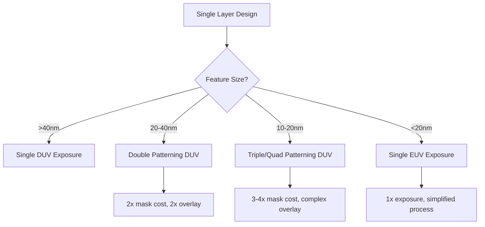

import AccessibleImage from '@site/src/components/AccessibleImage';
import AnimatedBlock from '@site/src/components/AnimatedBlock';
import Plot from '@site/src/components/Plot';
import SideBySide from '@site/src/components/SideBySide';

<AnimatedBlock>

The fundamental physics of light limits how small features we can print. The **Rayleigh criterion** tells us the minimum feature size achievable with optical lithography.

</AnimatedBlock>

## The Resolution Equation

<AnimatedBlock>

The famous resolution equation is:

$$
R = k_1 \frac{\lambda}{NA}
$$

Where:
- $R$ = minimum resolvable feature size
- $k_1$ = process factor (≈ 0.25 for optimized processes)
- $\lambda$ = wavelength of light
- $NA$ = numerical aperture of the optical system

</AnimatedBlock>

## Wavelength Comparison

<AnimatedBlock>

Here's why EUV's shorter wavelength is revolutionary:

</AnimatedBlock>

<Plot
  data={[
    {
      x: [436, 365, 248, 193, 13.5],
      y: [436 * 0.25, 365 * 0.25, 248 * 0.25, 193 * 0.25, 13.5 * 0.25],
      mode: 'lines+markers',
      type: 'scatter',
      name: 'Resolution Limit',
      line: { color: '#ff6b6b', width: 3 },
      marker: { size: 10 }
    }
  ]}
  layout={{
    title: 'Resolution vs Wavelength (k₁ = 0.25, NA = 1.0)',
    xaxis: { 
      title: 'Wavelength (nm)',
      type: 'log'
    },
    yaxis: { 
      title: 'Minimum Feature Size (nm)'
    },
    annotations: [
      {
        x: 193,
        y: 193 * 0.25,
        text: 'DUV ArF',
        showarrow: true,
        arrowhead: 2
      },
      {
        x: 13.5,
        y: 13.5 * 0.25,
        text: 'EUV',
        showarrow: true,
        arrowhead: 2
      }
    ],
    font: { family: 'Inter, sans-serif' }
  }}
  staticFallback="/img/static/resolution_vs_wavelength.png"
/>

## The Numerical Aperture Challenge

<AnimatedBlock>

Numerical aperture (NA) also improves resolution, but increasing NA has practical limits:

- **High NA means larger, heavier optics**
- **Depth of focus decreases**: $DOF \propto \frac{\lambda}{NA^2}$
- **Cost increases exponentially**

</AnimatedBlock>

<AccessibleImage 
  src="/img/high_na_euv_render.png" 
  alt="3D cutaway rendering of a high numerical aperture EUV optical system showing the complex arrangement of mirrors"
  caption="Figure 1: High-NA EUV system enabling sub-10nm resolution"
/>

## Why Multiple Patterning is Complex

<AnimatedBlock>

With 193nm DUV, achieving small features requires **multiple patterning** - exposing the same layer multiple times with different masks. This increases:

- **Process steps** (2x, 3x, even 4x exposures)
- **Overlay requirements** (each pattern must align perfectly)
- **Cost and complexity**
- **Defect opportunities**

</AnimatedBlock>

## Resolution Comparison Interactive

<Plot
  data={[
    {
      x: ['DUV 193nm Single Pattern', 'DUV 193nm Double Pattern', 'DUV 193nm Triple Pattern', 'EUV 13.5nm Single Pattern'],
      y: [48, 24, 16, 8],
      type: 'bar',
      marker: {
        color: ['#ff9999', '#ffcc99', '#ffff99', '#99ff99']
      },
      name: 'Minimum Feature Size'
    }
  ]}
  layout={{
    title: 'Feature Size Capabilities by Technology',
    xaxis: { title: 'Technology & Patterning Method' },
    yaxis: { title: 'Minimum Feature Size (nm)' },
    font: { family: 'Inter, sans-serif' }
  }}
  staticFallback="/img/static/technology_comparison.png"
/>

:::tip Key Insight
EUV's 13.5nm wavelength enables single-exposure patterning of features that would require complex multiple patterning with DUV, dramatically simplifying manufacturing while reducing cost and defects.
:::

## Real-World Impact

<AnimatedBlock>

The resolution advantage of EUV directly enables:

- **7nm, 5nm, 3nm process nodes**
- **Billion-transistor processors**
- **AI accelerators with massive compute density**
- **Mobile chips with all-day battery life**

</AnimatedBlock>

<AccessibleImage 
  src="/img/resist_ler_examples.png" 
  alt="Scanning electron microscope images comparing line edge roughness between DUV and EUV lithography processes"
  caption="Figure 2: Line edge roughness comparison showing EUV's superior pattern quality"
/>
