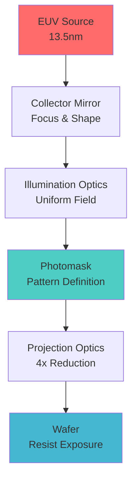

import Plot from '@site/src/components/Plot';
import AccessibleImage from '@site/src/components/AccessibleImage';
import AnimatedBlock from '@site/src/components/AnimatedBlock';

# Welcome to EUV Lithography Guide

<AnimatedBlock>

This site is built with **Docusaurus**, using **MDX** (Markdown + React) to provide an accessible, interactive learning experience for next-generation semiconductor manufacturing.

</AnimatedBlock>

## ✨ Features

<AnimatedBlock>

- ✅ **Accessible Design**: WCAG AA compliant with keyboard navigation and screen reader support
- ✅ **Interactive Animations**: Smooth, tasteful animations with Framer Motion (respects reduced motion preferences)
- ✅ **Dynamic Plots**: Interactive charts with Plotly and static fallbacks for print/performance
- ✅ **Mathematical Expressions**: Beautiful math rendering with KaTeX
- ✅ **Responsive Images**: WebP support with lazy loading and captions
- ✅ **Print-Friendly**: Optimized for PDF export and printing

</AnimatedBlock>

## 🔬 Interactive Example

<AnimatedBlock>

Here's a sample interactive plot showing the relationship between critical dimension and exposure dose:

</AnimatedBlock>

<Plot
  data={[
    {
      x: [10, 15, 20, 25, 30],
      y: [22, 18, 16, 14, 13],
      type: 'scatter',
      mode: 'lines+markers',
      name: 'CD vs Dose',
      line: { color: '#2ea3ff', width: 3 },
      marker: { size: 8, color: '#2ea3ff' }
    }
  ]}
  layout={{
    title: 'Critical Dimension vs Exposure Dose',
    xaxis: { title: 'Dose (mJ/cm²)' },
    yaxis: { title: 'Critical Dimension (nm)' },
    font: { family: 'Inter, sans-serif' }
  }}
  staticFallback="/img/static/cd_vs_dose.png"
/>

## 📐 Mathematical Expressions

<AnimatedBlock>

Here is an inline math example: $R = k_1 \frac{\lambda}{NA}$.

And a block equation showing the fundamental resolution limit:

$$
\text{Resolution} = k_1 \frac{\lambda}{NA}
$$

Where:
- $k_1$ is the process factor (≈ 0.25 for EUV)
- $\lambda$ is the wavelength (13.5 nm for EUV)
- $NA$ is the numerical aperture

</AnimatedBlock>

## 🖼️ Responsive Images

<AnimatedBlock>

Images are automatically optimized with multiple formats and sizes:

</AnimatedBlock>

<AccessibleImage 
  src="/img/cover_euv.png" 
  alt="EUV lithography machine showing the complex optical system with mirrors and light source"
  caption="Figure 1: Modern EUV lithography system demonstrating next-generation semiconductor manufacturing"
/>

## 📊 Mermaid Diagrams

<AnimatedBlock>

Process flow diagrams are rendered with Mermaid:

</AnimatedBlock>

## 🎯 Getting Started

<AnimatedBlock>

Ready to dive deeper? Explore our comprehensive chapters:

1. **[Photolithography Basics](/docs/chapters/02-photolithography-basics)** - Foundation concepts
2. **[Why EUV?](/docs/chapters/03-why-euv-rayleigh)** - The physics behind the technology
3. **[EUV Source](/docs/chapters/04-euv-source)** - How extreme ultraviolet light is generated
4. **[Mirrors & Optics](/docs/chapters/05-mirrors-optics)** - The optical system design

Each chapter includes interactive visualizations, detailed explanations, and real-world examples.

</AnimatedBlock>

---

<AnimatedBlock>

💡 **Tip**: Use the search function (Ctrl+K) to quickly find specific topics, or navigate using the sidebar for a structured learning path.

</AnimatedBlock>
